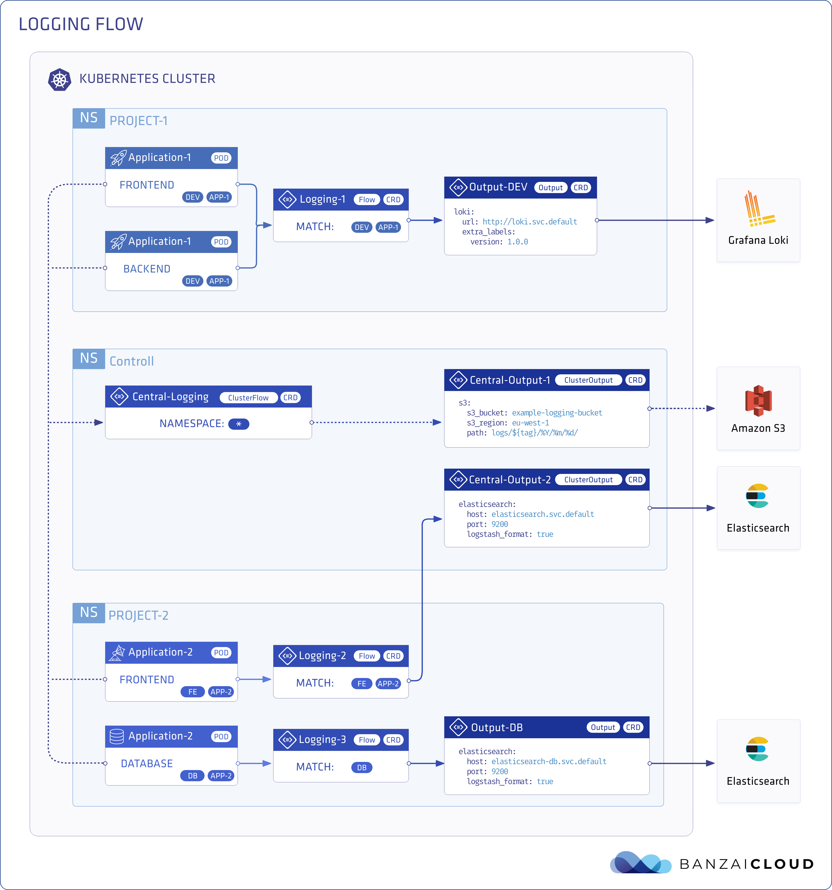

# Logging Operator

Logging operator for Kubernetes based on Fluentd and Fluent-bit.

The [Logging operator](https://github.com/banzaicloud/logging-operator) automates the deployment and configuration of a Kubernetes logging pipeline. The operator deploys and configures a Fluent Bit daemonset on every node to collect container and application logs from the node file system. Fluent Bit queries the Kubernetes API and enriches the logs with metadata about the pods, and transfers both the logs and the metadata to Fluentd. Fluentd receives, filters, and transfer logs to multiple outputs. Your logs will always be transferred on authenticated and encrypted channels.

**What is this operator for?**

This operator helps you bundle logging information with your applications: you can describe the behavior of your application in its charts, the Logging operator does the rest.

**Feature highlights**

* Namespace isolation
* Native Kubernetes label selectors
* Secure communication (TLS)
* Configuration validation
* Multiple flow support (multiply logs for different transformations)
* Multiple output support (store the same logs in multiple storage: S3, GCS, ES, Loki and more...)
* Multiple logging system support (multiple fluentd, fluent-bit deployment on the same cluster)

**Architecture**

You can define outputs (destinations where you want to send your log messages, for example, Elasticsearch, or and Amazon S3 bucket), and flows that use filters and selectors to route log messages to the appropriate outputs. You can also define cluster-wide outputs and flows, for example, to use a centralized output that namespaced users cannot modify.

You can configure the Logging operator using the following Custom Resource Descriptions.

* logging - Represents a logging system. Includes Fluentd and Fluent-bit configuration. Specifies the controlNamespace. Fluentd and Fluent-bit will be deployed in the controlNamespace
* output - Defines an Output for a logging flow. This is a namespaced resource. See also clusteroutput.
* flow - Defines a logging flow with filters and outputs. You can specify selectors to filter logs by labels. Outputs can be output or clusteroutput. This is a namespaced resource. See also clusterflow.
* clusteroutput - Defines an output without namespace restriction. Only effective in controlNamespace.
* clusterflow - Defines a logging flow without namespace restriction.

**Prerequisites**

* Logging operator requires Kubernetes v1.14.x or later.
* For the Helm-based installation you need Helm v3.2.1 or later.

## Create logging namespace

> This section applies only If not was previously created

It is always a good practice to create a custom namespace depending on the system, to maintain the cluster organized.

1. Create the namespace

    `kubectl create ns logging`

1. Swith to `logging` namespace

    `kubectl config set-context --current --namespace=logging`

## Deploy Logging Operator

Logging Operator is installed by using Helm charts, since has not been ported to OLM yet. The helm chart will deploy Fluentd & Fluent Bit Operator inside logging namespace.

1. Add Logging Operator helm repo from `banzaicloud.com`

    `helm3 repo add banzaicloud-stable https://kubernetes-charts.banzaicloud.com`

2. Install Logging Operator using helm3

    > It is a good practice to always specify the version to install or use.

    `helm3 install logging-operator banzaicloud-stable/logging-operator --version 3.9.4 --set createCustomResource=false`

    > Use `createCustomResource=false` with Helm v3 to avoid trying to create CRDs from the crds folder and from templates at the same time.

3. Verify installation checking all the pods are running

    `kubectl get pods`

4. Test the installation by deploying a manifest file (system monitoring) or the  `banzaicloud-stable/logging-demo`

    > Note to replace `quickstart` to `elastic-cluster` by editing the resource `output/logging-demo-output-elasticsearch`, since it is hardcoded within the example.

    `kubectl apply -f Kubernetes/files/logging.yaml`

5. Access to Kibana at https://localhost:5601

    `kubectl port-forward service/kibana-cluster-kb-http 5601`

    Use the following command to get the password to login into Kibana with `elastic`default user

    `kubectl get secret elastic-cluster-es-elastic-user -o=jsonpath='{.data.elastic}' | base64 --decode; echo`

    > By default, the Logging operator sends the incoming log messages into an index called fluentd. Create an Index Pattern that includes this index (for example, `fluentd*`), then select Menu > Kibana > Discover. You should see the dashboard and some sample log messages from the demo application. Finally use `time` (not `@timestamp` nor `timestamp`) as the primary time field, in order to get all the pods running into the cluster.