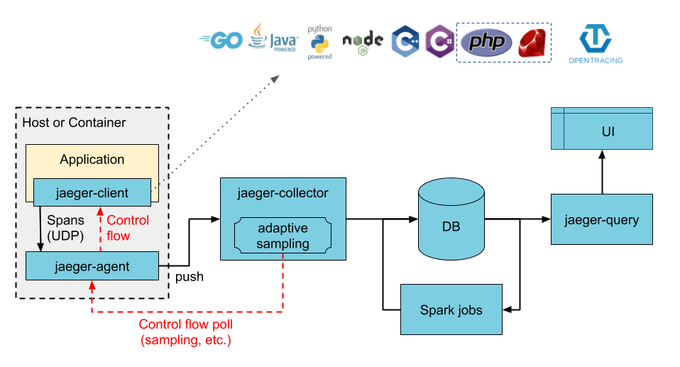

# Jaeger Operator

Running systems in production involves requirements for high availability, resilience and recovery from failure. When running cloud native applications this becomes even more critical, as the base assumption in such environments is that compute nodes will suffer outages, Kubernetes nodes will go down and microservices instances are likely to fail, yet the service is expected to remain up and running.

**Distributed Tracing**

Distributed tracing enables capturing requests and building a view of the entire chain of calls made all the way from user requests to interactions between hundreds of services. It also enables instrumentation of application latency (how long each request took), tracking the lifecycle of network calls (HTTP, RPC, etc) and also identify performance issues by getting visibility on bottlenecks.

**Jaeger**

Jaeger is an open-source distributed tracing system that implements the OpenTracing specification. Jaeger includes components to store, visualize and filter traces.

Jaeger has three main components: agent, collector, and query. There is also the Jaeger client, which is part of your application and is responsible for creating tracers and spans in the application code. In a typical Jaeger workflow on kubernetes, the Jaeger client creates trace spans in the application code which get picked up by the Jaeger agent over UDP and forwarded to the Jaeger collector using a secured gRPC connection.

Jaeger uses external services for ingesting and persisting the span data, such as Elasticsearch, Cassandra and Kafka. This is due to the fact that the Jaeger Collector is a stateless service and you need to point it to some sort of storage to which it will forward the span data. The Jaeger collector stores the data so that you can query and visualize the trace spans using the Jaeger query service. The following diagram illustrates the overall architecture:



There are three pre-defined Jaeger deployment strategies that are supported by the Jaeger Operator. A deployment strategy dictates how the Jaeger components should be deployed on kubernetes:

* production: it deploys the collector and query processes individually as separate pods on kubernetes, which can be scaled individually on demand. The production strategy also supports secured connections with Elasticsearch.
* allInOne: is an easy way to start and manage all Jaeger components for demonstration purposes, its extremely limited capability makes it unsuitable for even some serious test or development scenarios. In particular, it uses memory as its backend storage so there is no real data persistence, and it does not allow any scaling.

**Jaeger Agent**

The Jaeger agent is a daemon that receives spans from Jaeger clients over UDP, batches and forwards them to the collectors. The agent acts as a buffer to abstract out batch processing and routing from the clients.

Even though the agent was built to be used as a daemon, in a Kubernetes setup the agent can be configured to run as a sidecar container in the application Pod or as an independent DaemonSet .

**Jaeger Agent as Sidecar**

A sidecar Jaeger agent is a container that sits in the same pod as your application container. The application, denoted as Jaeger service myapp will send Jaeger spans to the agent over localhost to port 6381. These configurations are set via environment variables JAEGER_SERVICE_NAME, JAEGER_AGENT_HOST and JAEGER_AGENT_PORT in the client.

**Using Kafka to Ingest High-Load Jaeger Span Data**

If you monitor many microservices, if you have a high volume of span data, or if your system generates data bursts on occasions, then your external backend storage may not be able to handle the load and may become a bottleneck, impacting the overall performance. In such cases you should employ the streaming deployment strategy that I mentioned in the previous post which uses Kafka between the Collector and the storage to buffer the span data from the Jaeger Collector.


## Deploy Jaeger Operator

1. Install Jaeger Operator in the cluster

    By using Helm charts

    `helm3 repo add jaegertracing https://jaegertracing.github.io/helm-charts`

    `helm3 repo update`

    `helm3 install -n tracing --create-namespace jaeger-operator jaegertracing/jaeger-operator --version 2.21.0`

    To uninstall use the following command

    `helm3 uninstall jaeger-operator -n tracing`

    By using Oracle LifeCycle Management

    `kubectl create ns tracing`

    `kubectl config set-context --current --namespace=tracing`

    `kubectl create -f https://operatorhub.io/install/stable/jaeger.yaml`

2. Verify the installation

    `kubectl get crd`

3. Create Jaeger manifest using `all-in-one`  strategy and agents as `daemonset`

```bash
cat <<EOF | kubectl apply -n tracing -f -
apiVersion: jaegertracing.io/v1
kind: Jaeger
metadata:
  name: jaeger-all-in-one-inmemory
  agent:
    strategy: DaemonSet
EOF
```

4. Verify the resources created

    `kubectl get daemonset,all -n tracing`

    ```bash
    NAME                                              READY   STATUS    RESTARTS   AGE
    pod/jaeger-all-in-one-inmemory-6866f898c8-w8nmj   1/1     Running   0          106s
    pod/jaeger-operator-95cc95b47-4hkjt               1/1     Running   0          4m55s

    NAME                                                    TYPE        CLUSTER-IP       EXTERNAL-IP   PORT(S)                                  AGE
    service/jaeger-all-in-one-inmemory-agent                ClusterIP   None             <none>        5775/UDP,5778/TCP,6831/UDP,6832/UDP      106s
    service/jaeger-all-in-one-inmemory-collector            ClusterIP   10.96.205.94     <none>        9411/TCP,14250/TCP,14267/TCP,14268/TCP   106s
    service/jaeger-all-in-one-inmemory-collector-headless   ClusterIP   None             <none>        9411/TCP,14250/TCP,14267/TCP,14268/TCP   106s
    service/jaeger-all-in-one-inmemory-query                ClusterIP   10.100.130.141   <none>        16686/TCP                                106s
    service/jaeger-operator-metrics                         ClusterIP   10.108.95.62     <none>        8383/TCP,8686/TCP                        4m55s

    NAME                                         READY   UP-TO-DATE   AVAILABLE   AGE
    deployment.apps/jaeger-all-in-one-inmemory   1/1     1            1           106s
    deployment.apps/jaeger-operator              1/1     1            1           4m55s

    NAME                                                    DESIRED   CURRENT   READY   AGE
    replicaset.apps/jaeger-all-in-one-inmemory-6866f898c8   1         1         1       106s
    replicaset.apps/jaeger-operator-95cc95b47               1         1         1       4m55s
    ```

5. Create a Port-forward to test Jaeger UI at http://localhost:16686

  `kubectl port-forward -n tracing service/jaeger-all-in-one-inmemory-query 16686:16686`

## Deploy Jaeger using YAML manifest

> This deployment method is equal to the previous once, however this uses a YAML manifest file instead with all the needed dependencies

Deploy the Jaeger resources using the following command.

`kubectl apply -n tracing -f Kubernetes/files/jaeger-inmemory-sidecar.yaml`

## References

* [Best Practices Deploying Jaeger on Kubernetes](https://thenewstack.io/best-practices-for-deploying-jaeger-on-kubernetes-in-production/)
* [Jaeger Operator Embraces OpenTelemetry](https://medium.com/jaegertracing/jaeger-embraces-opentelemetry-collector-90a545cbc24)