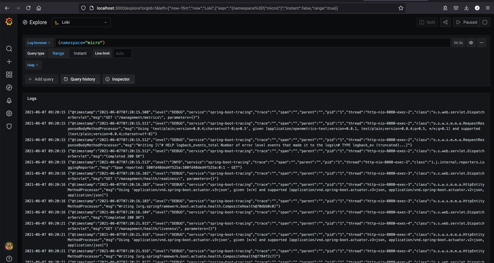

# Grafana Loki


Loki is a **horizontally-scalable**, **highly-available**, **multi-tenant** log aggregation system inspired by **Prometheus**. It is designed to be very cost effective and easy to operate. It **does not** index the contents of the logs, but rather a **set of labels** for each log stream.

Compared to other log aggregation systems, Loki:

* does not do full text indexing on logs. By storing compressed, unstructured logs and only indexing metadata, Loki is simpler to operate and **cheaper** to run.
* indexes and groups log streams using the same labels you’re already using with Prometheus, enabling you to seamlessly switch between metrics and logs using the same labels that you’re already using with Prometheus.
* is an especially good fit for storing Kubernetes Pod logs. Metadata such as Pod labels is automatically scraped and indexed.
* has native support in Grafana (needs Grafana v6.0).

A Loki-based logging stack consists of 3 components:

* **promtail** is the agent, responsible for gathering logs and sending them to Loki.
* **loki** is the main server, responsible for storing logs and processing queries.
* **Grafana** for querying and displaying the logs.


*Loki is like Prometheus, but for logs*: we prefer a multidimensional label-based approach to indexing, and want a single-binary, easy to operate system with no dependencies. Loki differs from Prometheus by focusing on logs instead of metrics, and delivering logs via **push**, instead of pull.

## Deployment

- Add `GrafanaLabs` Helm Charts Repository

    `helm3 repo add grafana https://grafana.github.io/helm-charts`

- Update helm charts

    `helm3 repo update`

- Deploy Loki Stack (Loki, Promtail, Grafana)

    `helm3 upgrade --install loki -n logging --create-namespace grafana/loki-stack --version 2.4.1 --set grafana.enabled=true`

- Deploy Loki and Fluent Bit to your cluster

    `helm upgrade --install loki -n logging --create-namespace grafana/loki-stack --version 2.4.1 --set fluent-bit.enabled=true,promtail.enabled=false`

## Grafana Explorer

- Get Loki Grafana User and password from deployment

    ```bash
    kubectl get secret -n logging loki-grafana -o=jsonpath='{.data.admin-user}' | base64 --decode; echo
    kubectl get secret -n logging loki-grafana -o=jsonpath='{.data.admin-password}' | base64 --decode; echo
    ```

- Port-forward Grafana dashboard to http://locaalhost:3000

    `kubectl port-forward -n logging svc/loki-grafana 3000:80`

- Check `Loki` is configured as used as **Data Sources**
  
- Click on **Explore** feature on the left menu and select `Loki` as Data Source on the top combo box that appears.

- Use **log browser** feature to filter the data or use following Loki query to filter logs by `namespace`.

    > It can be selected **Live** feature to wastch logs in pseudo real-time or select by an interval or period of time.

    `{namespace="micro"}`

    