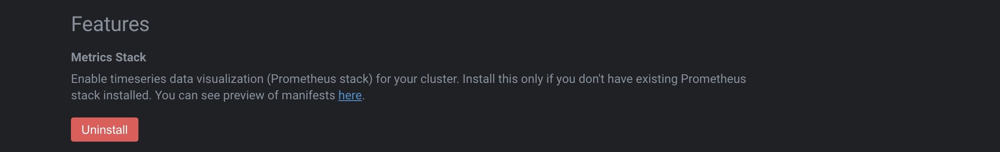

# Kubernetes Dashboards

There are several options to visualize, monitor and manage Kubernetes clusters via graphical interface. Depending on the needs, requirements and security concerns, cluster management can be done directly from the cluster itself, via installing **Web Dashboards** into the cluster, with necessary RBACs and  privileges to manage the kubernetes cluster, or using **IDEs**. Using IDEs requires to have **direct** access to the cluster, the `kubeconfig` file and enough privileges and roles to perform operations into the cluster.

Following are some tips to make a edcision whether using the proper dashboard:

* Use **Web Dashboards** when `configfile` or direct access to the cluster are not provided or allowed.
* Use **IDEs** when security requirements do not allow web applications to perform changes because attackers.

Integrated Development Environment (IDE):

* [k9s](https://github.com/derailed/k9s)
* [Lens](https://github.com/lensapp/lens)
* [Octant](https://github.com/vmware-tanzu/octant)

Web Dashboards:

* [Kubernetes Dashboard](https://github.com/kubernetes/dashboard)
* [KubeWatch](https://github.com/bitnami-labs/kubewatch)
* [Weave Scope](https://github.com/weaveworks/scope)
* [Zabbix](https://www.zabbix.com/)

## Lens

Lens - The Kubernetes IDE ("Lens IDE") is a distribution of the OpenLens repository with Team Lens specific customizations released under a traditional EULA. Lens IDE provides the full situational awareness for everything that runs in Kubernetes. It's lowering the barrier of entry for people just getting started and radically improving productivity for people with more experience.


Metrics can be also enabled by installing **Prometheus Stack** from the cluster settings in **Lens** (Right click on the cluster).




Download Lens from [release](https://github.com/lensapp/lens/releases) page.

## K9s

**K9s** provides a terminal UI to interact with your Kubernetes clusters. The aim of this project is to make it easier to navigate, observe and manage your applications in the wild. K9s continually watches Kubernetes for changes and offers subsequent commands to interact with your observed resources.


K9s is available on Linux, macOS and Windows platforms.

* Binaries for Linux, Windows and Mac are available as tarballs in the [release](https://github.com/derailed/k9s/releases) page.

* Via Homebrew for macOS or LinuxBrew for Linux

    `brew install k9s`

* Via Webi for Linux and macOS

    `curl -sS https://webinstall.dev/k9s | bash`

* Via Webi for Windows

    `curl.exe -A MS https://webinstall.dev/k9s | powershell`

## Octant

**Octant** is a tool for developers to understand how applications run on a Kubernetes cluster. It aims to be part of the developer's toolkit for gaining insight and approaching complexity found in Kubernetes. Octant offers a combination of introspective tooling, cluster navigation, and object management along with a plugin system to further extend its capabilities.


* Download the latest binaries from the official [release](https://github.com/vmware-tanzu/octant/releases) page.
* Open Octant and select the current kubernetes context (`kubeconfig`)
    > Note: If any error loading context happens, remove `.kube/config` file and use `KUBECONFIG` environment variable to point to a kubeconfig file instead.
* Select any options to see kubernetes resources, nodes, configuration, workloads, etc..

## Kubernetes ddashboard

Dashboard is a web-based Kubernetes user interface. You can use Dashboard to deploy containerized applications to a Kubernetes cluster, troubleshoot your containerized application, and manage the cluster resources. You can use Dashboard to get an overview of applications running on your cluster, as well as for creating or modifying individual Kubernetes resources (such as Deployments, Jobs, DaemonSets, etc). For example, you can scale a Deployment, initiate a rolling update, restart a pod or deploy new applications using a deploy wizard.

Dashboard also provides information on the state of Kubernetes resources in your cluster and on any errors that may have occurred.


* Install Kubernetes dashboard using manifest file

    `kubectl apply -f https://raw.githubusercontent.com/kubernetes/dashboard/v2.2.0/aio/deploy/recommended.yaml`

* Use the Proxy to access to the dashboard.

    `kubectl proxy`

* Access to the dashboard by using the proxy URL.

    > The UI can only be accessed from the machine where the command is executed. See `kubectl proxy --help` for more options.

    http://localhost:8001/api/v1/namespaces/kubernetes-dashboard/services/https:kubernetes-dashboard:/proxy/.

* Get the ``token`` from the secrets installed within `kube-system`.

    > ie.. `export SECRET_RESOURCE=default-token-bp8dj`

    ```bash
    kubectl get secrets -n kube-system
    kubectl get secret $SECRET_RESOURCE -n=kube-system -o json | jq -r '.data["token"]' | base64 --decode; echo
    ```
