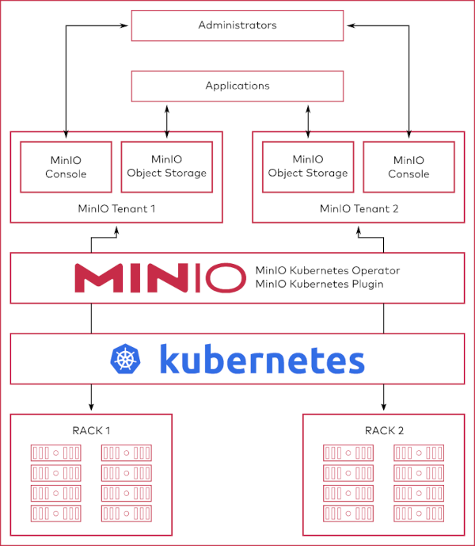
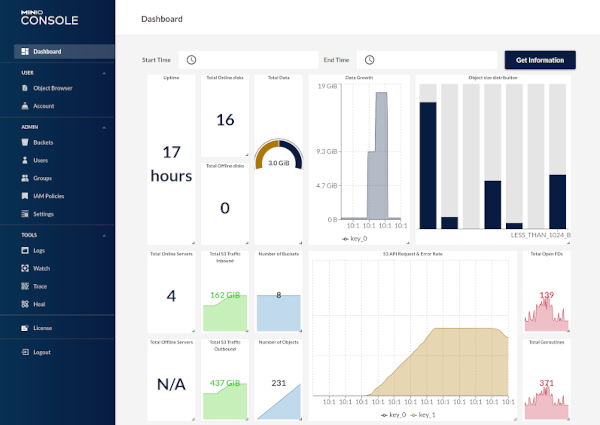
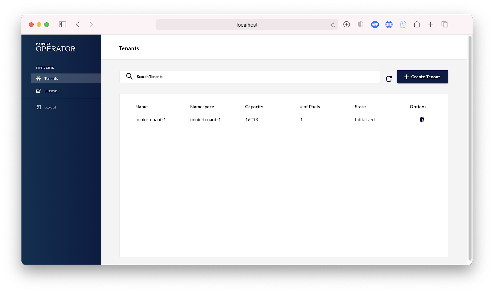

# MinIO Operator

MinIO is a High Performance Object Storage released under Apache License v2.0. It is API compatible with **Amazon S3** cloud storage service. Use MinIO to build high performance infrastructure for machine learning, analytics and application data workloads.

## MinIO Operator

The [MinIO Operator](https://github.com/minio/operator) extends the Kubernetes API to support deploying MinIO-specific resources as a Tenant in a Kubernetes cluster. The MinIO `kubectl minio` plugin wraps the Operator to provide a simplified interface for deploying and managing MinIO Tenants in a Kubernetes cluster through the kubectl command line tool.

The primary unit of managing MinIO on Kubernetes is the tenant. The best way to think about tenancy is to start with the Kubernetes cluster. The MinIO Operator can allocate multiple tenants within the same Kubernetes cluster. Each tenant, in turn, can have different capacity (i.e: a small 500GB tenant vs a 100TB tenant), resources (1000m CPU and 4Gi RAM vs 4000m CPU and 16Gi RAM) and servers (4 pods vs 16 pods), as well a separate configurations regarding Identity Providers, Encryption and versions.

Each **MinIO Tenant** represents an independent MinIO Object Store within the Kubernetes cluster. The following diagram describes the architecture of a MinIO Tenant deployed into Kubernetes:

The MinIO Console provides a graphical user interface (GUI) for interacting with MinIO Tenants.

Administrators of MinIO Tenants can perform a variety of tasks through the Console, including user creation, policy configuration, and bucket replication. The Console also provides a high level view of Tenant health, usage, and healing status.

## Deployment

[MinIO-Operator](https://github.com/minio/operator/tree/master/helm/minio-operator) Github page.

* Configure MinIO Helm repo

    `helm3 repo add minio https://operator.min.io/`

* Upgrade helm charts

    `helm3 repo update`

* Installing the Chart (with `default` tenant)

    > The command deploys MinIO Operator on the Kubernetes cluster in the default configuration.

    `helm3 install minio --namespace minio --create-namespace minio/minio-operator --version 4.1.0 -f Kubernetes/files/minio-operator-values.yaml`

* Access to the `default` MinIO Tenant Console (`admin/minio123`)

    `kubectl --namespace minio port-forward svc/default-console 9090`

## Deploy New MinIO Tenant

> MinIO supports one MinIO Tenant per namespace.

* Create new Namespace for the tenant

    `kubectl create ns minio-tenant`

* Deploy New MinIO Tenant

    `kubectl apply -n minio-tenant -f Kubernetes/files/minio-tenant.yaml`

* Access to the new MinIO Tenant Console (`YOURCONSOLEACCESS/YOURCONSOLESECRET`)

    `kubectl --namespace minio-tenant port-forward svc/minio-console 9090`

## MinIO Operator Console

The **Operator Console** makes Kubernetes object storage easier still. In this graphical user interface, MinIO created something so simple that anyone in the organization can create, deploy and manage object storage as a service.

* Get the JWT for logging in to the console:

    `kubectl get secret $(kubectl get serviceaccount console-sa --namespace minio -o jsonpath="{.secrets[0].name}") --namespace minio -o jsonpath="{.data.token}" | base64 --decode; echo`

* Access to MinIO Operator console

    `kubectl --namespace minio port-forward svc/console 9090`
