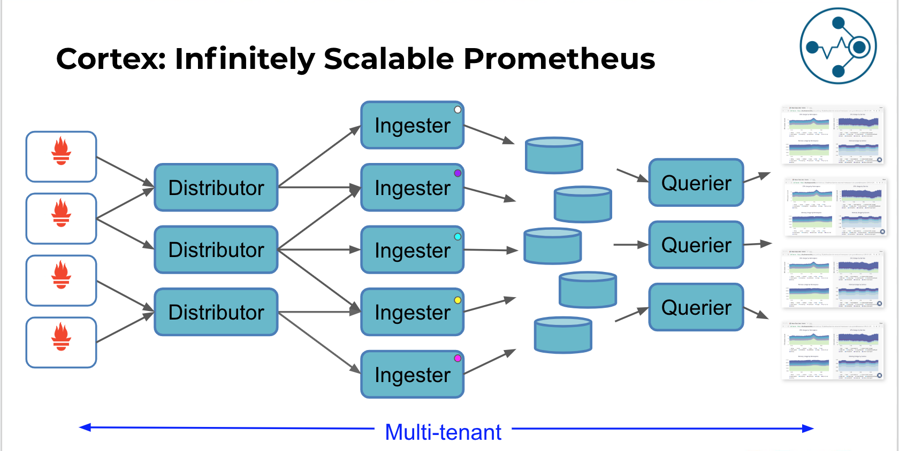

# Observable-Distributed-System

This repository is a project to show how to build an observable distributed system using common standards and frameworks

## Kubernetes

### Helm

**Helm** is a tool for managing Kubernetes charts. Charts are packages of pre-configured Kubernetes resources.

- Find and use popular software packaged as Helm charts to run in Kubernetes
- Share your own applications as Helm charts
- Create reproducible builds of your Kubernetes applications
- Intelligently manage your Kubernetes manifest files
- Manage releases of Helm packages

#### Helm Installation

- Download helm from official repository

    ```bash
    # Following will install the latest version, for production use specific version
    curl https://raw.githubusercontent.com/kubernetes/helm/master/scripts/get
    ```

- Initialize `helm` to deploy the necessary pods into eks cluster

    ```bash
    kubectl -n kube-system create sa tiller

    kubectl create clusterrolebinding tiller --clusterrole cluster-admin --serviceaccount=kube-system:tiller

    helm init --service-account tiller
    ```

- Verify helm is correctly installed

    ```bash
    helm version
    ```

- **Update** local helm repo to be up-to-date to the latest chart versions.

    ```bash
    helm repo update
    ```

- To **remove** `tiller` from server

    ```bash
    helm reset --force
    ```

### Traefik Ingress (Ingress-controller)

**Traefik** is a modern HTTP reverse proxy and load balancer that makes deploying microservices easy. Traefik integrates with your existing infrastructure components (Docker, Swarm mode, Kubernetes, Marathon, Consul, Etcd, Rancher, Amazon ECS, ...) and configures itself automatically and dynamically. Pointing Traefik at your orchestrator should be the only configuration step you need.

#### Traefik Installation

- Install `traefik` for ingress controller using helm

    ```bash
    helm install --name traefik-ingress --namespace kube-system --set dashboard.enabled=true,metrics.prometheus.enabled=true,rbac.enabled=true,dashboard.domain=traefik.management.com,dashboard.ingress.annotations."kubernetes\.io/ingress\.class"=traefik stable/traefik

    # Configured to use with Prometheus annotations.
    helm install --name traefik-ingress --namespace kube-system --set dashboard.enabled=true,metrics.prometheus.enabled=true,rbac.enabled=true,dashboard.domain=traefik.management.com,dashboard.service.annotations."prometheus\.io/scrape"=true,dashboard.service.annotations."prometheus\.io/port"=8080,dashboard.ingress.annotations."kubernetes\.io/ingress\.class"=traefik stable/traefik
    ```

    Output:

    ```txt
    NOTES:

    1. Get Traefik's load balancer IP/hostname:

    NOTE: It may take a few minutes for this to become available.

    You can watch the status by running:

            $ kubectl get svc traefik-ingress --namespace kube-system -w

    Once 'EXTERNAL-IP' is no longer '<pending>':

            $ kubectl describe svc traefik-ingress --namespace kube-system | grep Ingress | awk '{print $3}'

    1. Configure DNS records corresponding to Kubernetes ingres  resources to point to the load balancer IP/hostname found in step 1
    ```

    > Wait until de the `EXTERNAL-IP` is no longer `<pending>`, like it is noted after installing the chart.

- Check the configuration for `traefik-ingress`

    ```bash
        kubectl describe svc traefik-ingress --namespace kube-system
        kubectl get pod,svc --all-namespaces
    ```

- Access to [traefik dashbard](http://traefik.management.com)

### Prometheus and Grafana

- Install `Prometheus`

    ```bash
    helm install --name prometheus --namespace monitoring --set server.ingress.enabled=true,server.ingress.annotations."kubernetes\.io/ingress\.class"=traefik,server.ingress.hosts={prometheus.monitoring.com},alertmanager.ingress.enabled=true,alertmanager.ingress.annotations."kubernetes\.io/ingress\.class"=traefik,alertmanager.ingress.hosts={alertmanager.monitoring.com} stable/prometheus
    ```

    > The Prometheus server can be accessed via port 80 on the following DNS name from within your cluster: `prometheus-server.monitoring.svc.cluster.local`

- Check all the resources (pods, services, pvc, pc, ingress,etc..) haven been **successfully** created.

    ```bash
    kubectl get all -n monitoring
    ```

    > NOTE: `cAdvisor` (integrated inside `kubelet`), `node-exporter` and `kube-state-metrics` are **eXporters** that expose different metrics with snapshots of the kubernetes cluster.

    ```txt
    service/prometheus-kube-state-metrics   ClusterIP   None             <none>        80/TCP     1m
    service/prometheus-node-exporter        ClusterIP   None             <none>        9100/TCP   1m
    ```

- Install `Grafana` 

    ```bash
    helm install --name grafana-dashboard --namespace monitoring --set persistence.enabled=true,ingress.enabled=true,ingress.annotations."kubernetes\.io/ingress\.class"=traefik,ingress.hosts={grafana.monitoring.com},plugins={grafana-piechart-panel} stable/grafana
    ```

    > It can be added custom plugins via helm chart. i.e `grafana-piechart-panel`

- Get the credentials to access grafana dashboard (`admin`)

    ```bash
    kubectl get secret --namespace monitoring grafana-dashboard -o jsonpath="{.data.admin-password}" | base64 --decode ; echo
    ```

- Set `prometheus` datasource and the dashboards into grafana (http://grafana.monitoring.com/)

  > Use `http://prometheus-server.monitoring.svc.cluster.local` as URL in grafana datasource
  
  - Node eXporter: 405
  - Cadvisor: 893
  - Kubernetes cluster monitoring: 1621
  - Kubernetes Cluster (Prometheus): 6417
  - Kubernetes cluster monitoring (via Prometheus): 315
  - Analysis by Pod: 6879
  - Cluster cost & utilization metrics: 8670
  - K8s Cluster Summary (by Node and Namespaces): 8685
  - Kubernetes App Metrics: 1471 (cpu, memory compared to limits, etc..)
  - Kubernetes Cluster (workload): 7249 (Good summary, split by namespace, deployment, pods, etc..)
  - Traefik dashborad: 4475

- Add `traefik` extra metrics and dashboard (grafana dashboard: 4475)

    ```bash
    kubectl get service -n kube-system
    kubectl get -n kube-system service traefik-ingress-dashboard -o yaml > traefik-service.yaml

    # Open and add modify following information
    # Add    - annotations:
    #             prometheus.io/scrape: "true"
    #             prometheus.io/port: '8080'

    kubectl delete -f traefik-service.yaml
    kubectl apply -f traefik-service.yaml

    # Use /dashboard or /metrics. Also check the dashboard 4475 in grafana to view metrics
    kubectl get service -n kube-systeme traefik-ingress-dashboard
    ```

- **Uninstall** helm packages

        helm del grafana-dashboard --purge
        helm del prometheus --purge
        helm del traefik-ingress --purge

### Logging

In this section it will be explained how-to deploy EFK stack into kubernetes cluster.

#### Elasticsearch

[Stable helm Chart](https://hub.kubeapps.com/charts/stable/elasticsearch)

Install **Elastic Search** cluster, with only 1 client/data replicas and 2 masters (quorum).

```bash
helm install --name elasticsearch --namespace logging --set client.ingress.enabled=true,client.ingress.annotations."kubernetes\.io/ingress\.class"=traefik,client.ingress.hosts={elasticsearch.logging.com},client.replicas=1,master.replicas=2,data.replicas=1,cluster.env.MINIMUM_MASTER_NODES=2 stable/elasticsearch
```

Output, after installing the chart.

```bash
NOTES:
The elasticsearch cluster has been installed.

Elasticsearch can be accessed:

  * Within your cluster, at the following DNS name at port 9200:

    elasticsearch-client.logging.svc

  * From outside the cluster, run these commands in the same shell:

    export POD_NAME=$(kubectl get pods --namespace logging -l "app=elasticsearch,component=client,release=elasticsearch" -o jsonpath="{.items[0].metadata.name}")
    echo "Visit http://127.0.0.1:9200 to use Elasticsearch"
    kubectl port-forward --namespace logging $POD_NAME 9200:9200
```

**Wait** until all the pods still pending:

```bash
kubectl get pods -n logging -w
```

**Verify** the current es client can be accessed from ingress:

- http://elasticsearch.logging.com/
- http://elasticsearch.logging.com/_count?pretty (if `port-forward` use http://localhost:9200 )

  ```json
  {
    "count" : 0,
    "_shards" : {
      "total" : 0,
      "successful" : 0,
      "skipped" : 0,
      "failed" : 0
    }
  }
  ```

#### Kibana

[Stable helm Chart](https://hub.kubeapps.com/charts/stable/kibana)

Install **kibana** helm chart

```bash
helm install --name kibana --namespace logging --set ingress.enabled=true,ingress.annotations."kubernetes\.io/ingress\.class"=traefik,ingress.hosts={kibana.logging.com},env.ELASTICSEARCH_HOSTS=http://elasticsearch-client:9200,service.externalPort=80 stable/kibana
```

> **NOTE:** Be care, from `kibana v6.6.x`, it has been changed the env variables. In this case `ELASTICSEARCH_URL` is no longer valid and it has been replaced by `ELASTICSEARCH_HOSTS`.

Output, after installing the chart.

```bash
NOTES:
To verify that kibana has started, run:

  kubectl --namespace=logging get pods -l "app=kibana"

Kibana can be accessed:

  * From outside the cluster, run these commands in the same shell:

    export NODE_PORT=$(kubectl get --namespace logging -o jsonpath="{.spec.ports[0].nodePort}" services kibana)
    export NODE_IP=$(kubectl get nodes --namespace logging -o jsonpath="{.items[0].status.addresses[0].address}")
    echo http://$NODE_IP:$NODE_PORT
```

#### Fluent Bit (daemonset)

[Stable helm Chart](https://hub.kubeapps.com/charts/stable/fluent-bit)

Install **Fluent Bit** helm chart

```bash
helm install --name fluentbit --namespace logging --set backend.type=es,backend.es.host=elasticsearch-client,service.logLevel=info,filter.mergeJSONLog=false stable/fluent-bit

# With mergeJSONLog, useful to merge JSON, from original app logs.
# Use `@timestamp_es` as an indexr in kibana
helm install --name fluentbit --namespace logging --set backend.type=es,backend.es.host=elasticsearch-client,service.logLevel=info,filter.mergeJSONLog=true,backend.es.time_key=@timestamp_es stable/fluent-bit

```

> NOTE: `input.systemd.enabled=true` is important to capture also logs from kubelet (i.e. `ImagePullBackOff`). However this is not working actually.

Output, after installing the chart.

```bash
NOTES:
fluent-bit is now running.

It will forward all container logs to the svc named elasticsearch-client on port: 9200

```
> To verify the installation, check if the pods are connected to the backend (elasticsearch) via logs. `kubectl logs -n logging pods/fluentbit-fluent-bit-wjhsr`

#### EFK

Now, lets configure it and get more deep into the efk stack.

- First, check if all the pods, services, etc are running

```bash
kubectl get all -n logging
```

- After the installation, check again http://elasticsearch.logging.com/_count?pretty or http://localhost:9200/_count?pretty

  ```json
  {
    "count" : 1648,
    "_shards" : {
      "total" : 6,
      "successful" : 6,
      "skipped" : 0,
      "failed" : 0
    }
  }
  ```

- Enter into [kibana dashboard](http://kibana.logging.com) for the initialization
  - Create an **index**, using `kubernetes_cluster-*` or simply `*`.
  - Use `@timestamp` or `@timestamp_es` (+ json merged) as a time filter for all the  traced logs.

  > `@timestamp_es` needs to be configured as a key inside `fluentbit` so it won´t conflict with the default `@timestamp` added by default for the traces.

- From this point, all the **logs** traced by the appilcations inside the cluster and namespaces are centralized using *EFK*.

  - kube-apiserver
  - tiller
  - kube-controller-manager
  - etcd
  - traefik-ingres
  - etc..

- As an example, run the following command to test correct and failure logs.

  ```bash
  kubectl run nginx --image=nginx --replicas=1

  # Since the image version does not exist, it throws a 'ImagePullBackOff' status error
  kubectl run nginx --image=nginx:4321 --replicas=1
  ```

  ```txt
  ...
  kubernetes.container_name: kube-controller-manager
  kubernetes.namespace_name: kube-system
  ...
  log: I0519 07:22:38.320591       1 event.go:218] Event(v1.ObjectReference{Kind:"ReplicaSet", Namespace:"default", Name:"nginx-756ff8975b", UID:"e17df8e0-7a06-11e9-96c2-025000000001", APIVersion:"extensions", ResourceVersion:"2804", FieldPath:""}): type: 'Normal' reason: 'SuccessfulCreate' Created pod: nginx-756ff8975b-td6w2
  ...
  ```

- Create  a filter or DSL query using `log:*nginx*` and `ImagePullBackOff`

- Information prompted deploying My-SQL helm chart (`I0519`).

  ```json
  I0519 09:23:17.353146       1 event.go:218] Event(v1.ObjectReference{Kind:"PersistentVolumeClaim", Namespace:"storage", Name:"mysql-release", UID:"b8bc13ee-7a17-11e9-a4a1-025000000001", APIVersion:"v1", ResourceVersion:"1514", FieldPath:""}): type: 'Normal' reason: 'ExternalProvisioning' waiting for a volume to be created, either by external provisioner "docker.io/hostpath" or manually created by system administrator
  ```

- Error Prompted from helm (`E0519`).

  ```json
  {
    "_index": "kubernetes_cluster-2019.05.19",
    "_type": "flb_type",
    "_id": "4jZnz2oBKte1OHWKC7hz",
    "_version": 1,
    "_score": null,
    "_source": {
      "@timestamp_es": "2019-05-19T09:23:17.372Z",
      "log": "E0519 09:23:17.372584       1 pv_protection_controller.go:116] PV pvc-b8bc13ee-7a17-11e9-a4a1-025000000001 failed with : Operation cannot be fulfilled on persistentvolumes \"pvc-b8bc13ee-7a17-11e9-a4a1-025000000001\": the object has been modified; please apply your changes to the latest version and try again\n",
      "stream": "stderr",
      "time": "2019-05-19T09:23:17.3729255Z",
      "kubernetes": {
        "pod_name": "kube-controller-manager-docker-for-desktop",
        "namespace_name": "kube-system",
        "pod_id": "52d5d585-7a16-11e9-a4a1-025000000001",
        "labels": {
          "component": "kube-controller-manager",
          "tier": "control-plane"
        },
        "annotations": {
          "kubernetes_io/config_hash": "7c34d027d0fbe6a010a0e1180164e72d",
          "kubernetes_io/config_mirror": "7c34d027d0fbe6a010a0e1180164e72d",
          "kubernetes_io/config_seen": "2019-05-19T09:12:03.944251Z",
          "kubernetes_io/config_source": "file",
          "scheduler_alpha_kubernetes_io/critical-pod": ""
        },
        "host": "docker-for-desktop",
        "container_name": "kube-controller-manager",
        "docker_id": "472f17eaf65e3191a90d0dbb542a6fd267b6e14922f500a0a5b7405e82044134"
      }
    },
    "fields": {
      "@timestamp_es": [
        "2019-05-19T09:23:17.372Z"
      ],
      "kubernetes.annotations.kubernetes_io/config_seen": [
        "2019-05-19T09:12:03.944Z"
      ],
      "time": [
        "2019-05-19T09:23:17.372Z"
      ]
    },
    "sort": [
      1558257797372
    ]
  }
  ```

### Tracing


## Prometheus

### Kubernetes - Configuration

There are multiple ways to configure `targets` using **Prometheus**. Those targets are scraped (via **pull** method) in order to collect their metrics. The traditional approach is by using **static** configuration, using a configuration file. On the other hand, the **dynamic** approach uses *service discovery* methods to get the online targets. Since the beginning of kubernetes, new ways have appeared to configure endpoints, one of them is by using the `Prometheus Operator` and the other is using `Annotations`, the last one using k8s DSL and service definitions.

#### Annotations

Prometheus scrapes can be added dynamically by configuration (annotations) via DSL and using kubernetes definitions. Refer to this [link](https://www.weave.works/docs/cloud/latest/tasks/monitor/configuration-k8s/) for further information

Annotations on pods allow a fine control of the scraping process:

- `prometheus.io/scrape`: The default configuration will scrape all pods and, if set to `false`, this annotation will exclude the pod from the scraping process.
- `prometheus.io/path`: If the metrics path is not `/metrics`, define it with this annotation.
- `prometheus.io/port`: Scrape the pod on the indicated port instead of the pod’s declared ports (default is a port-free `target` if none are declared).

Following is a real example used to create kube-state-metrics service

```yaml
apiVersion: v1
kind: Service
metadata:
  annotations:
    prometheus.io/scrape: "true"
  labels:
    app: prometheus
    chart: prometheus-8.9.2
    component: kube-state-metrics
    heritage: Tiller
    release: prometheus
  name: prometheus-kube-state-metrics
  namespace: prometheus
spec:
  clusterIP: None
  ports:
  - name: http
    port: 80
    protocol: TCP
    targetPort: 8080
  selector:
    app: prometheus
    component: kube-state-metrics
    release: prometheus
  sessionAffinity: None
  type: ClusterIP
```

### Kubernetes - Pod-Container Limits

Resource **Limits** (*cpu* and *memory*) per deployment are exposed via metrics. Those metrics related to the API configuration are collected by `kube-state-metrics`. This eXporter collects the limits configured by a deployment; also it collects many other metrics HPA, status, etc... This is not a daemoner, since all the metrics are the same and it is not needed HA. 

Dashboard and metrics that help us to get this information are:

- Kubernetes App Metrics: 1471 (cpu, memory compared to limits, etc..)
- `container_spec_memory_limit_bytes` vs `container_memory_usage_bytes`
- `container_spec_memory_reservation_limit_bytes`
- `container_cpu_usage_seconds_total` vs `container_spec_cpu_quota` vs `container_spec_cpu_period`
- `kube_pod_container_resource_requests`
- `kube_pod_container_resource_requests_memory_bytes`
- `kube_pod_container_resource_requests_cpu_cores`
- `kube_pod_container_resource_limits`
- `kube_pod_container_resource_limits_memory_bytes`

#### MY-SQL

Resources configured by default for `requests` resources:

```yaml
## Configure resource requests and limits
## ref: http://kubernetes.io/docs/user-guide/compute-resources/
##
resources:
  requests:
    memory: 256Mi
    cpu: 100m
```

- Create the `my-sql` using helm:

    ```bash
    helm install --name mysql-release --namespace storage --set mysqlRootPassword=secretpassword,mysqlUser=my-user,mysqlPassword=my-password,mysqlDatabase=my-database stable/mysql
    ```

- Following are some query examples.

    ```json
    container_spec_memory_reservation_limit_bytes{container_name="mysql-release"}
    container_spec_memory_limit_bytes{container_name="mysql-release"}
    ```

- Get all the resources *requested* by the container `mysql-release`

    ```json
    kube_pod_container_resource_requests{container="mysql-release"}
    ```

    ```json
    kube_pod_container_resource_requests{app="prometheus",chart="prometheus-8.9.2",component="kube-state-metrics",container="mysql-release",heritage="Tiller",instance="10.1.4.81:8080",job="kubernetes-service-endpoints",kubernetes_name="prometheus-kube-state-metrics",kubernetes_namespace="monitoring",kubernetes_node="docker-for-desktop",namespace="storage",node="docker-for-desktop",pod="mysql-release-5ffb44984c-cjnhl",release="prometheus",resource="cpu",unit="core"}

    0.1

    kube_pod_container_resource_requests{app="prometheus",chart="prometheus-8.9.2",component="kube-state-metrics",container="mysql-release",heritage="Tiller",instance="10.1.4.81:8080",job="kubernetes-service-endpoints",kubernetes_name="prometheus-kube-state-metrics",kubernetes_namespace="monitoring",kubernetes_node="docker-for-desktop",namespace="storage",node="docker-for-desktop",pod="mysql-release-5ffb44984c-cjnhl",release="prometheus",resource="memory",unit="byte"} 

    268435456
    ```

- Get the memory (bytes) resources *requested* by the container `mysql-release`

    ```json
    kube_pod_container_resource_requests_memory_bytes{container="mysql-release"}
    ```

    ```json
    kube_pod_container_resource_requests_memory_bytes{app="prometheus",chart="prometheus-8.9.2",component="kube-state-metrics",container="mysql-release",heritage="Tiller",instance="10.1.4.81:8080",job="kubernetes-service-endpoints",kubernetes_name="prometheus-kube-state-metrics",kubernetes_namespace="monitoring",kubernetes_node="docker-for-desktop",namespace="storage",node="docker-for-desktop",pod="mysql-release-5ffb44984c-cjnhl",release="prometheus"}

    268435456
    ```json

### Kubernetes - Horizontal Pod Autoscaler (HPA)

> Be careful, this installation will **break** traefik-controller. It must be change the type from `ClusterIP` to `NodePort` inside `prometheus-server` service.

- Create `nginx-controller` using hpa kind.

    ```bash
    helm install --name nginx-release --namespace nginx --set controller.autoscaling.enabled=true,controller.autoscaling.minReplicas=3,resources.limits.cpu=100m,resources.limits.memory=64Mi,resources.requests.cpu=100m,resources.requests.memory=64Mi stable/nginx-ingress
    ```

- From `kube-state-metrics` can e extracted som useful information regarding **initial** configuration and **current** status.

- `kube_hpa_labels`
- `kube_hpa_metadata_generation`
- `kube_hpa_spec_max_replicas` vs `kube_hpa_spec_min_replicas`
- `kube_hpa_status_condition` (AbleToScale, ScalingActive, ..)
- `kube_hpa_status_current_replicas` vs `kube_hpa_status_desired_replicas`

### Prometheus at Scale (HA)

The **Prometheus** website provides some basic details and instruction on how do HA. For most people already operating in the Kubernetes world, the typical way of getting Prometheus to be HA is simply to use Kubernetes itself – i.e to have multiple instances of Prometheus and to deploy it into Kubernetes, so that Kubernetes can manage the temporary loss of infrastructure.

This approach however still leaves some problems unsolved namely:

- **Data Retention**: Prometheus will still only keep a small window of data – if you want to review historical data to see what the system was doing last week/month/etc, you can’t.
- **Data Inconsistency**: Just putting a load balancer in front of multiple Prometheus assumes that all of them were up and able to scrape the same metrics – a new instance starting up will have no historical data.
- **Hidden Outages**: If Prometheus is supposed to be monitoring Kubernetes, then there is the potential problem of an **outage** on Kubernetes not being reported because Prometheus wasn’t up to notice it

The third problem can be solved using autoscaling type functionality. For example in AWS with autoscaling groups, the configuration for Prometheus could live in either the user data attached to the autoscaling group, or an S3 bucket, but this still leaves the other problems.

In this section we discuss the options more active and trying to deal with this issue: **Thanos** and **Cortex**

#### Thanos


**Thanos** is a set of components that can be composed into a highly available metric system with unlimited storage capacity, which can be added seamlessly on top of existing Prometheus deployments.

**Thanos** leverages the Prometheus 2.0 storage format to cost-efficiently store historical metric data in any object storage while retaining fast query latencies. Additionally, it provides a global query view across all Prometheus installations and can merge data from Prometheus HA pairs on the fly.

Concretely the aims of the project are:

- Global query view of metrics (PromQL).
- Unlimited retention of metrics (google objet storate, s3, etc..).
- High availability of components, including Prometheus.


#### Cortex


**Cortex** is a  horizontally scalable, highly available, multi-tenant, long term storage for Prometheus.

- **Horizontally scalable**: Cortex can run across multiple machines in a cluster, exceeding the throughput and storage of a single machine. This enables you to send the metrics from multiple Prometheus servers to a single Cortex cluster and run "globally aggregated" queries across all data in a single place.
- **Highly available**: When run in a cluster, Cortex can replicate data between machines. This allows you to survive machine failure without gaps in your graphs.
- **Multi-tenant**: Cortex can isolate data and queries from multiple different independent Prometheus sources in a single cluster, allowing untrusted parties to share the same cluster.
- **Long term storage**: Cortex supports Amazon DynamoDB, Google Bigtable, Cassandra, S3 and GCS for long term storage of metric data. This allows you to durably store data for longer than the lifetime of any single machine, and use this data for long term capacity planning.

Cortex is a **CNCF** sandbox project used in several production systems including Weave Cloud and GrafanaCloud. Cortex is a primarily used as a remote write destination for Prometheus, with a Prometheus-compatible query API.



## Configuration

### DNS

Edit your `/etc/hosts` file with this configuration bellow.

```txt
127.0.0.1   traefik.management.com
127.0.0.1   grafana.monitoring.com
127.0.0.1   prometheus.monitoring.com
127.0.0.1   alertmanager.monitoring.com
127.0.0.1   elasticsearch.logging.com
127.0.0.1   kibana.logging.com
```