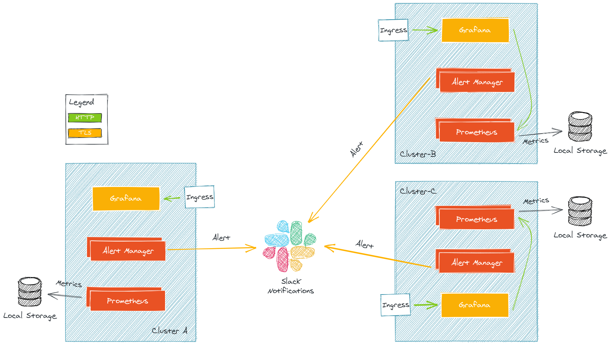
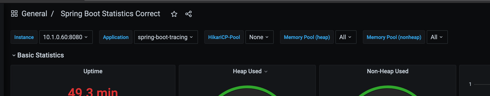
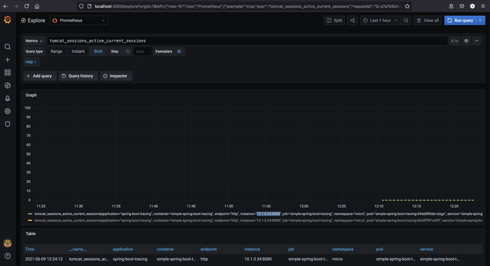

# Kube Prometheus

[Prometheus](https://github.com/prometheus/prometheus), a Cloud Native Computing Foundation project, is a systems and service monitoring system. It collects metrics from configured targets at given intervals, evaluates rule expressions, displays the results, and can trigger alerts when specified conditions are observed.

The features that distinguish Prometheus from other metrics and monitoring systems are:

* A multi-dimensional data model (time series defined by metric name and set of key/value dimensions)
* PromQL, a powerful and flexible query language to leverage this dimensionality
* No dependency on distributed storage; single server nodes are autonomous
* An HTTP pull model for time series collection
* Pushing time series is supported via an intermediary gateway for batch jobs
* Targets are discovered via service discovery or static configuration
* Multiple modes of graphing and dashboarding support
* Support for hierarchical and horizontal federation


[Kube Prometheus](https://github.com/prometheus-operator/kube-prometheus) collects Kubernetes manifests, Grafana dashboards, and Prometheus rules combined with documentation and scripts to provide easy to operate end-to-end Kubernetes cluster monitoring with Prometheus using the Prometheus Operator.

The content of this project is written in jsonnet. This project could both be described as a package as well as a library.

Components included in this package:

* The Prometheus Operator
* Highly available Prometheus
* Highly available Alertmanager
* Prometheus node-exporter
* Prometheus Adapter for Kubernetes Metrics APIs
* kube-state-metrics
* Grafana

This stack is meant for cluster monitoring, so it is pre-configured to collect metrics from all Kubernetes components. In addition to that it delivers a default set of dashboards and alerting rules. Many of the useful dashboards and alerts come from the kubernetes-mixin project, similar to this project it provides composable jsonnet as a library for users to customize to their needs.

## kube Prometheus Stack

[Kube-prometheus stack](https://github.com/prometheus-community/helm-charts/tree/main/charts/kube-prometheus-stack) is a collection of Kubernetes manifests, Grafana dashboards, and Prometheus rules combined with documentation and scripts to provide easy to operate end-to-end Kubernetes cluster monitoring with Prometheus using **Kube Prometheus** and the **Prometheus Operator**.

> Note: This chart was formerly named `prometheus-operator` chart, now renamed to more clearly reflect that it installs the kube-prometheus project stack, within which Prometheus Operator is only one component.
Prerequisites

This stack is often comprise of several components:

* Prometheus: collect metrics
* AlertManager: send alerts to various provider based on metrics query
* Grafana: fancy dashboards



**Pre-requisites**

* Kubernetes 1.16+
* Helm 3+

## kube Prometheus Stack Installation

In order to install kube Prometheus Stack:

1. Add Get Repo to Helm

    `helm3 repo add prometheus-community https://prometheus-community.github.io/helm-charts`

2. Update Helm for new repositories.

    `helm3 repo update`

3. Install `kube-prometheus-stack` Chart into `monitoring` namespaceç

    > Use `helm3 show values prometheus-community/kube-prometheus-stack` to get the default values configuration

    `helm3 install -n monitoring --create-namespace prometheus prometheus-community/kube-prometheus-stack --version 16.12.1 --set prometheus-node-exporter.hostRootFsMount=false`

    > Because an issue in `nodeExporter`, the value for `hostRootFsMount` has been set to false

4. Uninstall chart

    `helm3 uninstall -n monitoring prometheus`

5. Verify the installation by accessing to Prometheus Dashboard http://localhost:9090.

    `kubectl port-forward -n monitoring svc/prometheus-kube-prometheus-prometheus 9090`

    > Note: There are several errors in targets: `kube-controller-manager`, `kube-proxy`, `kube-etcd` and `kube-scheduler`. Please follow this issue for more information: https://stackoverflow.com/questions/65901186/kube-prometheus-stack-issue-scraping-metrics

## Grafana Dashboards

1. Create a Port forward to access Grafana Dashboard.

    `kubectl port-forward -n monitoring svc/prometheus-grafana 3000:80`

2. Access to Grafana using http://localhost:3000 (`admin/prom-operator`)

## Thanos

[Thanos](https://github.com/thanos-io/thanos) is a set of components that can be composed into a highly available metric system with unlimited storage capacity, which can be added seamlessly on top of existing Prometheus deployments.

Thanos is a CNCF Incubating project.

Thanos leverages the Prometheus 2.0 storage format to cost-efficiently store historical metric data in any object storage while retaining fast query latencies. Additionally, it provides a global query view across all Prometheus installations and can merge data from Prometheus HA pairs on the fly.

Concretely the aims of the project are:

* Global query view of metrics.
* Unlimited retention of metrics.
* High availability of components, including Prometheus.


Thanos can be deployed using prometheus operator. Please refer to [Thanos official repository](https://github.com/prometheus-operator/prometheus-operator/blob/master/Documentation/thanos.md) for more information. Also it has a [Thanos Helm chart](https://github.com/bitnami/charts/tree/master/bitnami/thanos)

### How does it work ?

Thanos is running alongside Prometheus. It is common to start with a Prometheus only setup and to upgrade to a Thanos one.

Thanos is split into several components. The component communicate with each other through gRPC.

**Thanos Sidecar**

Thanos is running alongside Prometheus (with a sidecar) and export Prometheus metrics every 2h to an object storage. This allow Prometheus to be almost stateless. Prometheus is still keeping 2 hours worth of metrics in memory so you might still loose 2 hours worth of metrics in case of outage (this is problem which should be handle by your Prometheus setup, with HA/Sharding, and not by Thanos).

Thanos sidecar is available out of the box with Prometheus Operator and Kube Prometheus Stack and can be deploy easily. This component act as a store for Thanos Query.

**Thanos Store**

Thanos store acts as a gateway to translate query to remote object storage. It can also cache some information on local storage. Basically this is the component that allows you to query an object store for metrics. This component acts as a store for Thanos Query

**Thanos Compactor**

Thanos compactor is a singleton (it is not scalable) that is responsible for compacting and downsampling the metrics stored inside an object store. Downsampling is the action of loosing granularity on your metrics over time. For example you may want to keep your metrics for 2 or 3 year but you do not need so many data points as your metrics from yesterday. This is what the compactor is for, saving you byte on your object storage and therefore saving you $.

**Thanos Query**

Thanos Query is the main component of Thanos, it is the central point where you send promQL query to. Thanos query exposes a Prometheus compatible endpoints. Then it dispatches query to all of it “stores”. Keep in mind the store may be any other Thanos component that serves metrics. Thanos query can dispatch a query to:

* Another Thanos query (they can be stacked)
* Thanos store
* Thanos sidecar

Thanos query is also responsible for deduplicating the metrics if the same metrics come from different stores or Prometheuses. For example if you have a metric which is in a Prometheus and also inside an object store, Thanos query can deduplicate the metrics. Deduplication also works based on Prometheus replicas and shard in the case of a Prometheus HA setup.

**Thanos Query Frontend**

As hinted by its name, Thanos Query Frontend acts a frontend for Thanos Query, its goal is to split large query into multiple smaller queries and also to cache the query result (either in memory or in a memcached)

There are also other components such as Thanos Receive in the case of remote write but this is still not the topic of this article.

## Dashboards

Dashobard can be imported using json files or ID.

> Grafana dashboard import can be found at [link](http://localhost:3000/dashboard/import). Do not forget to select the default `DataSource`, in this case `Prometheus(default)`

* [Node Exporter Full - 1860](https://grafana.com/grafana/dashboards/1860)
* [Traefik - 4475](https://grafana.com/grafana/dashboards/4475)
* [Spring Boot Statistics - 6756](https://grafana.com/grafana/dashboards/6756)

    ```bash
    # application (spring-boot-tracing) and instance (10.1.0.60:8080) are necessary to be configured into the dashboard
    tomcat_sessions_active_max_sessions{application="spring-boot-tracing", container="simple-spring-boot-tracing", endpoint="http", instance="10.1.0.60:8080", job="simple-spring-boot-tracing", namespace="micro", pod="simple-spring-boot-tracing-86c4b5795b-mdnvp", service="simple-spring-boot-tracing"}
    ```

    Grafana Spring Boot Statistics Configuration 

    

    Using **Grafana Explorer** feature and using Prometheus DataSource

    

* [MongoDB Exporter - 2583](https://grafana.com/grafana/dashboards/2583)

## FAQ

* For the `kube-proxy` down status do the following,

    Modify the configmap for kube-proxy

    `kubectl edit cm/kube-proxy -n kube-system`

    Change the metricsBindAddress from `127.0.0.110249` to `0.0.0.0:10249`

    ```yaml
    ...
    kind: KubeProxyConfiguration
    metricsBindAddress: 0.0.0.0:10249
    ...
    ```

    Restart the pod to take the new configuration

    `kubectl delete pod -l k8s-app=kube-proxy -n kube-system`
