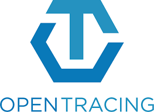
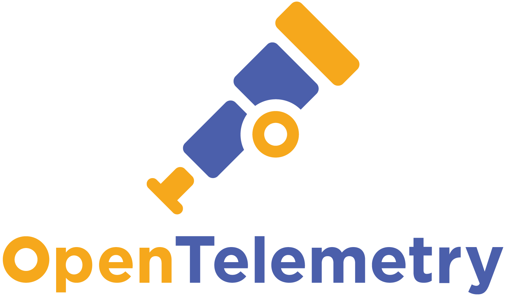
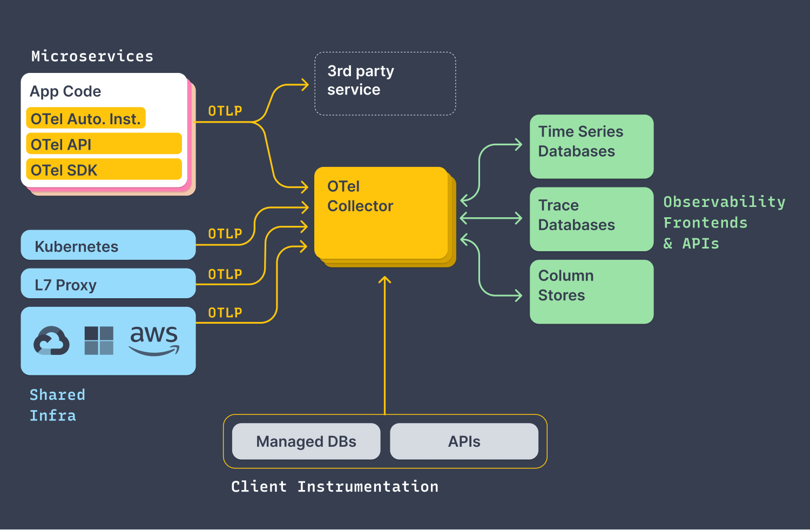
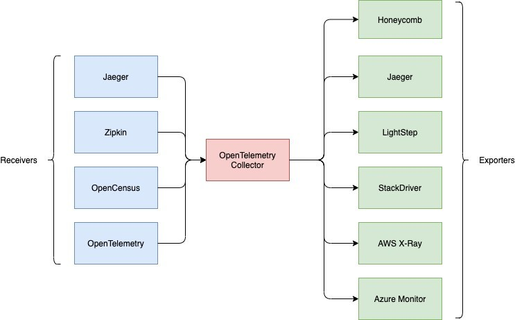
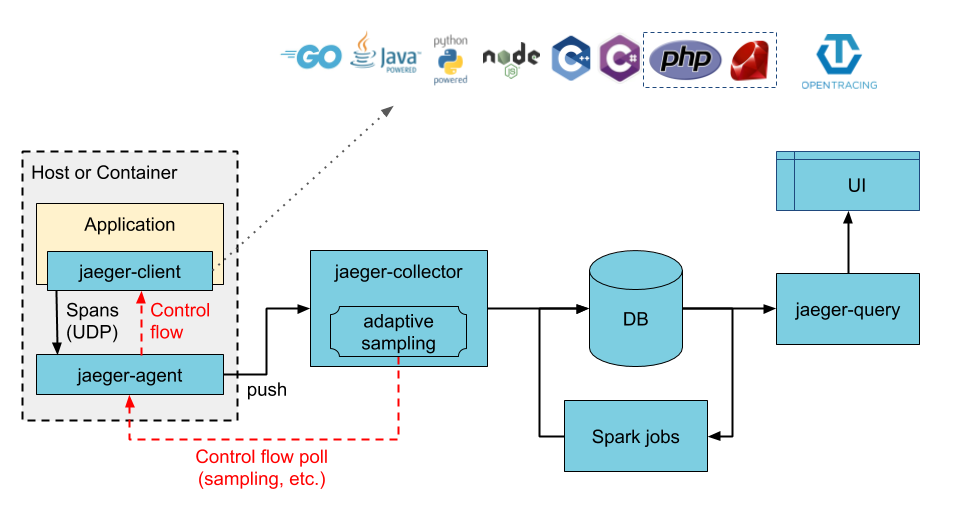
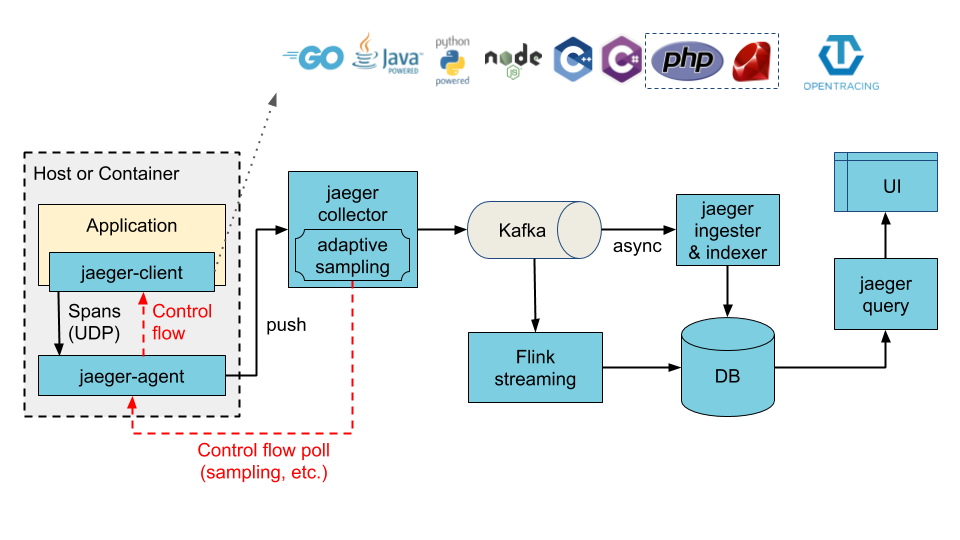
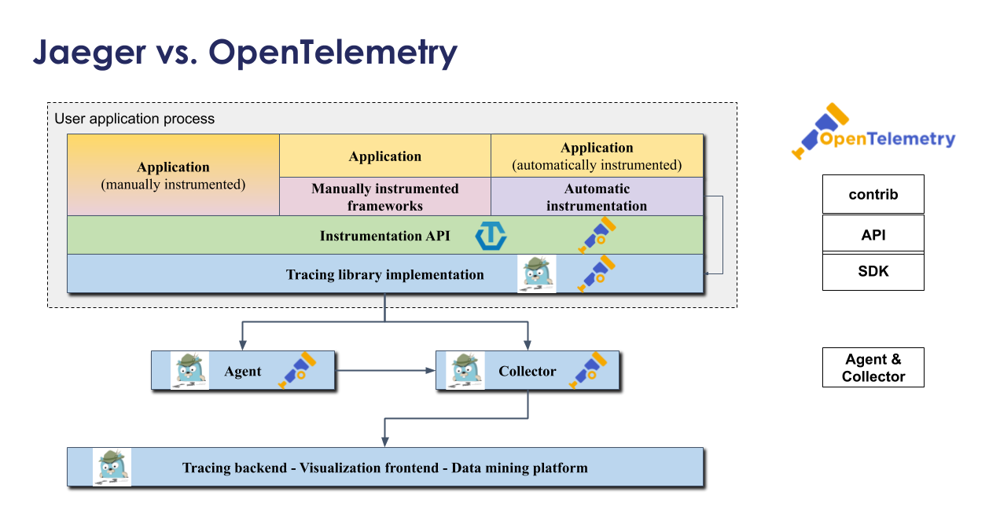

# Jaeger & Observability

## Observability

In software, **observability** generally refers to the ability to understand an application’s behavior and performance based only on its telemetry. Put more simply, observability is what allows you to understand what’s happening in production without changing your code.

In distributed systems, this telemetry can be divided into three overarching flavors:

* **(Distributed) Traces**: detailed records of the paths that distinct requests take as they propagate across an entire system (including across service boundaries)
* **Metrics**: aggregate statistics (mostly counters and gauges) about processes and infrastructure, typically with key:value tags attached to disaggregate patterns
* **Logs**: timestamped messages – sometimes structured – emitted by services or other components (though, unlike traces, not necessarily associated with any particular user request or transaction)

**Observability** is not the same thing as finding a tracing tool, a metrics tool, and a logging tool: it’s about solving problems by putting that telemetry data to work. In this way, you can think of OpenTelemetry as the first step in any observability strategy since high-quality, vendor-neutral data is a great starting point.

## Open Tracing



Running systems in production involves requirements for high availability, resilience and recovery from failure. When running cloud native applications this becomes even more critical, as the base assumption in such environments is that compute nodes will suffer outages, Kubernetes nodes will go down and microservices instances are likely to fail, yet the service is expected to remain up and running.

**Distributed tracing** enables capturing requests and building a view of the entire chain of calls made all the way from user requests to interactions between hundreds of services. It also enables instrumentation of application latency (how long each request took), tracking the lifecycle of network calls (HTTP, RPC, etc) and also identify performance issues by getting visibility on bottlenecks.

**Open Tracing** is an open-source CNCF (Cloud Native Computing Foundation) project which provides vendor-neutral APIs and instrumentation for distributed tracing. Although OpenTracing and OpenCensus have merged to form OpenTelemetry in early 2019, third-party libraries and frameworks like Hazelcast IMDG still come equipped with OpenTracing pre-instrumentation.

**OpenTracing** uses following ouns and verbs.


* **Trace**: The description of a transaction as it moves through a distributed system.
* **Span**: A named, timed operation representing a piece of the workflow. Spans accept key:value tags as well as fine-grained, timestamped, structured logs attached to the particular span instance.
* **Span context**: Trace information that accompanies the distributed transaction, including when it passes the service to service over the network or through a message bus. The span context contains the trace identifier, span identifier, and any other data that the tracing system needs to propagate to the downstream service.

## Open Telemetry



**OpenTelemetry** is a program framework that combines roles of **OpenTracing** and **OpenCensu**s. It aims to provide a set of frameworks that’s easy to implement across several languages. This means with OpenTelemetry you can easily move OpenTracing and OpenCensus without any significant changes.

The **OpenTelemetry** project makes robust, portable telemetry a built-in feature of cloud-native software.

High-velocity development and reliable, proactive operations require an effective observability strategy. Rich telemetry is the foundation of cloud-native observability.



By connecting best-in-class observability tools to **OpenTelemetry**, dev and ops gain insights into the reliability and behavior of their applications while maintaining high performance and vendor neutrality in their instrumentation.

While the exact details differ between implementations, the general process of integrating with OpenTelemetry is consistent:

* First, get your process and core libraries instrumented. Auto-instrumentation is a great first step
* Validate your instrumentation by sending it to an observability tool like Lightstep
* Learn how to troubleshoot instrumentation issues
* With a good understanding of your telemetry, enrich your data with custom attributes and events
* Explore advanced topics and best practices to improve collection and analysis

Here is a step-by-step guide to making the process easier:

* The first step in OpenTelemetry is communication between * collectors, and different back ends through exporters. 
* The next step will be for the collector to aggregate, batch, and * process according to the collection’s configuration.
* Then the collector and the exporter exchange data in the form of * telemetry, which is usually sent as an in-process. 
* The next step is the need for processing extensions, which can be added by SDK and allows for effects such as filtering, samplings, and enrichments. Sometimes, it’s possible to replace the SDK with an alternative. But to understand this process, we have to first look at the various components of OpenTelemetry.  

OpenTelemetry has several components, these includes:



* **APIs**: APIs are a core element to OpenTelemetry that are specific to the coding language of the program itself. These are some of the foundations of the program.
* **SDK**: This component is also unique to each coding language. It focuses on building the gap between exported elements and the APIs. The SDK also allows other features like transaction sampling and filtering, making them ideal in OpenTelemetry.
* **Exporters**: This is needed to determine where you want your telemetry sent. This exporter allows you to easily decouple your code from the back-end configuration, making it easy to alternate back ends without having to re-instrument your code.
* **Collectors**: This function in telemetry is optional, but a very useful component of OpenTelemetry because it allows for flexibility in the sending and receiving of application telemetry to the back ends. There are two models of deployment of the collector. The first is the agent that uses the same host with the application, and the second is a standalone process which is separate and doesn’t use the same host with the application.

## Jaeger Operator


**Jaeger** is an open-source distributed tracing system that implements the OpenTracing specification. Jaeger includes components to store, visualize and filter traces.

Jaeger has three main components: agent, collector, and query. There is also the Jaeger client, which is part of your application and is responsible for creating tracers and spans in the application code. In a typical Jaeger workflow on kubernetes, the Jaeger client creates trace spans in the application code which get picked up by the Jaeger agent over UDP and forwarded to the Jaeger collector using a secured gRPC connection.

Jaeger uses external services for ingesting and persisting the span data, such as Elasticsearch, Cassandra and Kafka. This is due to the fact that the Jaeger Collector is a stateless service and you need to point it to some sort of storage to which it will forward the span data. The Jaeger collector stores the data so that you can query and visualize the trace spans using the Jaeger query service. The following diagram illustrates the overall architecture:



There are three pre-defined Jaeger deployment strategies that are supported by the Jaeger Operator. A deployment strategy dictates how the Jaeger components should be deployed on kubernetes:

* production: it deploys the collector and query processes individually as separate pods on kubernetes, which can be scaled individually on demand. The production strategy also supports secured connections with Elasticsearch.
* allInOne: is an easy way to start and manage all Jaeger components for demonstration purposes, its extremely limited capability makes it unsuitable for even some serious test or development scenarios. In particular, it uses memory as its backend storage so there is no real data persistence, and it does not allow any scaling.

**Jaeger Agent**

The Jaeger agent is a daemon that receives spans from Jaeger clients over UDP, batches and forwards them to the collectors. The agent acts as a buffer to abstract out batch processing and routing from the clients.

Even though the agent was built to be used as a daemon, in a Kubernetes setup the agent can be configured to run as a sidecar container in the application Pod or as an independent DaemonSet .

**Jaeger Agent as Sidecar**

A sidecar Jaeger agent is a container that sits in the same pod as your application container. The application, denoted as Jaeger service myapp will send Jaeger spans to the agent over localhost to port 6381. These configurations are set via environment variables JAEGER_SERVICE_NAME, JAEGER_AGENT_HOST and JAEGER_AGENT_PORT in the client.

**Using Kafka to Ingest High-Load Jaeger Span Data**

If you monitor many microservices, if you have a high volume of span data, or if your system generates data bursts on occasions, then your external backend storage may not be able to handle the load and may become a bottleneck, impacting the overall performance. In such cases you should employ the streaming deployment strategy that I mentioned in the previous post which uses Kafka between the Collector and the storage to buffer the span data from the Jaeger Collector.



## Open Telemetry vs Jaeger



## Deployment

1. Install Jaeger Operator in the cluster

    By using Helm charts

    `helm3 repo add jaegertracing https://jaegertracing.github.io/helm-charts`

    `helm3 repo update`

    `helm3 install -n tracing --create-namespace jaeger-operator jaegertracing/jaeger-operator --version 2.24.0`

    To uninstall use the following command

    `helm3 uninstall jaeger-operator -n tracing`

    By using Oracle LifeCycle Management

    `kubectl create ns tracing`

    `kubectl config set-context --current --namespace=tracing`

    `kubectl create -f https://operatorhub.io/install/stable/jaeger.yaml`

2. Verify the installation

    `kubectl get crd`

3. Create Jaeger manifest using `all-in-one`  strategy and agents as `daemonset`

```bash
cat <<EOF | kubectl apply -n tracing -f -
apiVersion: jaegertracing.io/v1
kind: Jaeger
metadata:
  name: jaeger-all-in-one
  agent:
    strategy: DaemonSet
EOF
```

4. Verify the resources created

    `kubectl get daemonset,all -n tracing`

    ```bash
    NAME                                              READY   STATUS    RESTARTS   AGE
    pod/jaeger-all-in-one-6866f898c8-w8nmj   1/1     Running   0          106s
    pod/jaeger-operator-95cc95b47-4hkjt               1/1     Running   0          4m55s

    NAME                                                    TYPE        CLUSTER-IP       EXTERNAL-IP   PORT(S)                                  AGE
    service/jaeger-all-in-one-agent                ClusterIP   None             <none>        5775/UDP,5778/TCP,6831/UDP,6832/UDP      106s
    service/jaeger-all-in-one-collector            ClusterIP   10.96.205.94     <none>        9411/TCP,14250/TCP,14267/TCP,14268/TCP   106s
    service/jaeger-all-in-one-collector-headless   ClusterIP   None             <none>        9411/TCP,14250/TCP,14267/TCP,14268/TCP   106s
    service/jaeger-all-in-one-query                ClusterIP   10.100.130.141   <none>        16686/TCP                                106s
    service/jaeger-operator-metrics                         ClusterIP   10.108.95.62     <none>        8383/TCP,8686/TCP                        4m55s

    NAME                                         READY   UP-TO-DATE   AVAILABLE   AGE
    deployment.apps/jaeger-all-in-one   1/1     1            1           106s
    deployment.apps/jaeger-operator              1/1     1            1           4m55s

    NAME                                                    DESIRED   CURRENT   READY   AGE
    replicaset.apps/jaeger-all-in-one-6866f898c8   1         1         1       106s
    replicaset.apps/jaeger-operator-95cc95b47               1         1         1       4m55s
    ```

5. Create a Port-forward to test Jaeger UI at http://localhost:16686

  `kubectl port-forward -n tracing service/jaeger-all-in-one-query 16686:16686`

## Deploy Jaeger using YAML manifest

> This deployment method is equal to the previous once, however this uses a YAML manifest file instead with all the needed dependencies

Deploy the Jaeger resources using the following command.

> This will deploy jaeger-agent as a `Sidecar` within the pod, similar **OpenTelemetry** does.

`kubectl apply -n tracing -f kubernetes/manifests/jaeger-sidecar.yaml`

Also, it can be deployed as a `DaemonSet` or `Streaming` using kafka for example.

`kubectl apply -n tracing -f kubernetes/manifests/jaeger-daemonset.yaml`

## References

* [Best Practices Deploying Jaeger on Kubernetes](https://thenewstack.io/best-practices-for-deploying-jaeger-on-kubernetes-in-production/)
* [Jaeger Operator Embraces OpenTelemetry](https://medium.com/jaegertracing/jaeger-embraces-opentelemetry-collector-90a545cbc24)