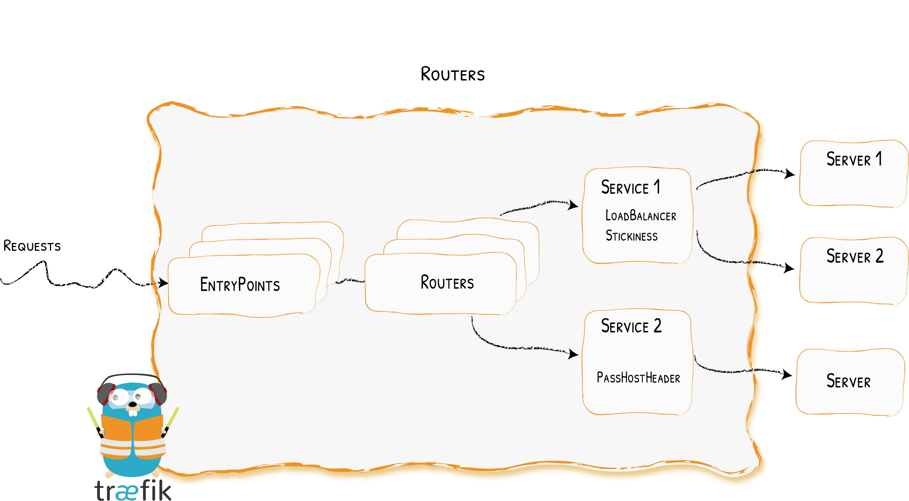

# Traefik Controller

## Traefik Proxy

First, when you start **Traefik**, you define **entrypoints** (in their most basic forms, they are port numbers). Then, connected to these entrypoints, **routers** analyze the incoming requests to see if they match a set of rules. If they do, the router might transform the request using pieces of **middleware** before forwarding them to your **services**.


These are the main components:

* **Providers** discover the services that live on your infrastructure (their IP, health, ...)
* **Entrypoints** are the network entry points into Traefik. They define the **port** which will receive the packets, and whether to listen for TCP or UDP. Default entry points are `web`, `websecure`, etc...

    

* **Routers**  are in charge of connecting incoming requests to the services that can handle them. In the process, routers may use pieces of **middleware** to update the request, or act before forwarding the request to the service. Routers analyse the requests (host, path, headers, SSL, ...). Routers are defined using `IngressRoute` within kubernetes as CRDs.

    

* **Services** forward the request to your services (load balancing, ...).

    

* **Middlewares** may update the request or make decisions based on the request (authentication, rate limiting, headers, ...). The Services are responsible for configuring how to reach the actual services that will eventually handle the incoming requests.

## Deployment

1. Install Traefik Controller in the cluster

    Add Traefik repo to Heml

    `helm3 repo add traefik https://helm.traefik.io/traefik`

    `helm3 repo update`

    Install Traefik into the `tools` namespace

    > Get all the services within tracing namespace to get jaeger services (agent and collector)

    ```bash
    helm3 install -n tools --create-namespace traefik traefik/traefik --version 9.19.1 \
    --set 'additionalArguments[0]=--api.insecure' \
    --set 'additionalArguments[1]=--metrics.prometheus=true' \
    --set 'additionalArguments[2]=--tracing.jaeger=true' \
    --set 'additionalArguments[3]=--tracing.serviceName=traefik-service' \
    --set 'additionalArguments[4]=--tracing.jaeger.samplingParam=1.0' \
    --set 'additionalArguments[5]=--tracing.jaeger.disableAttemptReconnecting=false' \
    --set 'additionalArguments[6]=--tracing.jaeger.samplingType=const' \
    --set 'additionalArguments[7]=--tracing.jaeger.samplingServerURL=http://jaeger-all-in-one-agent.tracing.svc:5778/sampling' \
    --set 'additionalArguments[8]=--tracing.jaeger.localAgentHostPort=jaeger-all-in-one-agent.tracing.svc:6831'
    ```

    Installing Traefik using a YAML values file

    `helm3 install -n tools --create-namespace traefik traefik/traefik --version 9.19.1 -f kubernetes/manifests/traefik-values.yaml`

2. Verify the installation by accessing to Jeager UI via traefik (loadbalancer) at http://localhost/search

    `kubectl get svc -n tools`

3. Deploy prometheus-operator `ServiceMonitor` resource using the following command.

    > Note: Prometheus operator is required. Set the label `release` set to match with the prometheus-operator `release: prometheus`

    `kubectl apply -n tools -f kubernetes/manifests/traefik-service-monitor.yaml`

4. Access to the *dashboard* and *metrics* exposed by traefik

    `kubectl port-forward -n tools svc/traefik-dashboard 9000`

   * [Dashboard](localhost:9000/dashboard)
   * [Prometheus Metrics](http://localhost:9000/metrics)

5. Delete Traefik Controller in the cluster

    `helm3 uninstall -n tools traefik`

6. Deploy traefik `IngressRoute` to allow external traffic to access to traefik dashboard using basic authentication (`admin/pass`)

    `kubectl apply -n tools -f kubernetes/manifests/traefik-ingress-route.yaml`

    http://traefik.management.com (`admin/pass`)

## References

There are several articles to how configure `traefik` to be used with **Jaeger** and **Prometheus**.

* Prometheus

  * [Capture Prometheus Metrics](https://traefik.io/blog/capture-traefik-metrics-for-apps-on-kubernetes-with-prometheus/)
  * [Github Example](https://github.com/traefik-tech-blog/traefik-sre-metrics)

* Jaeger

  * [Traefik and Jaeger on Kubernetes](https://traefik.io/blog/application-request-tracing-with-traefik-and-jaeger-on-kubernetes/   )